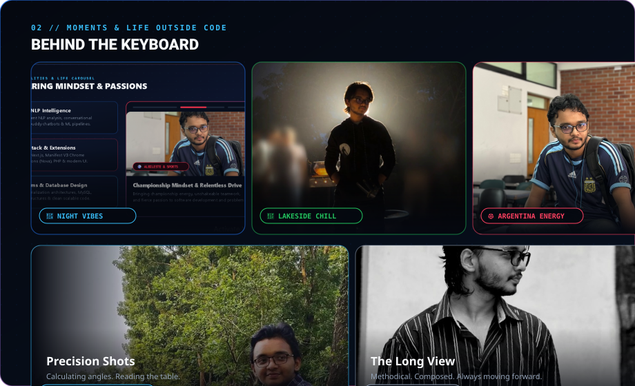
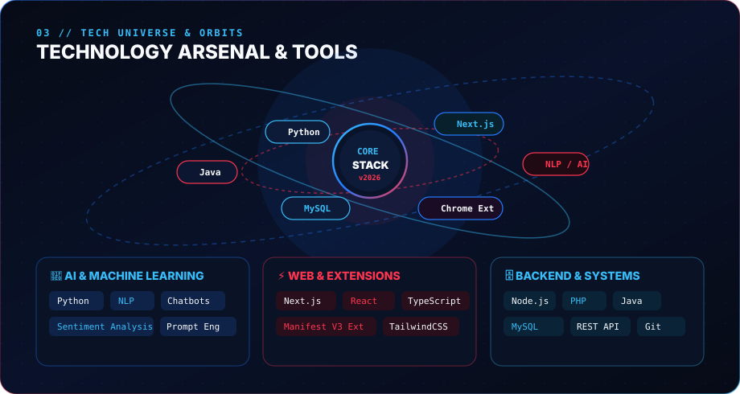
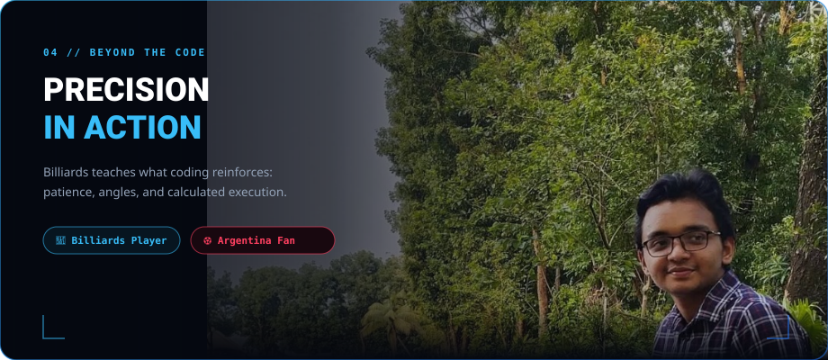
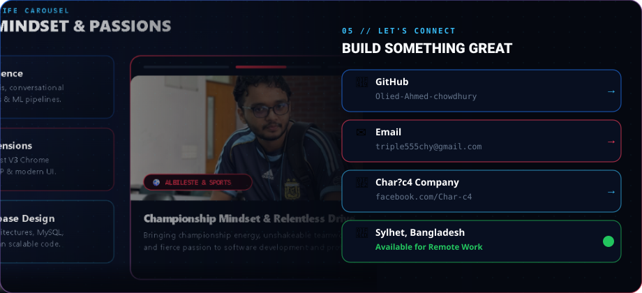

# Hi, I'm Olied Ahmed Chowdhury 👋

---

---

---

---

## 📊 GitHub Stats & Contributions

 

 

---

## 🚀 Featured Projects

| Project | Description | Stack |
| :--- | :--- | :--- |
| 🧩 **[Nova Chrome Extension](https://github.com/Olied-Ahmed-chowdhury/nova-chrome-extension)** | Feature-rich Manifest V3 Chrome Extension for browser productivity | `JavaScript` `Chrome API` `Manifest V3` |
| 🧠 **[AI Study Buddy](https://github.com/Olied-Ahmed-chowdhury/AI-Chatbot-AI-Study-Buddy)** | NLP-powered conversational AI for interactive learning | `Python` `NLP` `ML` |
| 📊 **[Tweet Sentiment NLP](https://github.com/Olied-Ahmed-chowdhury/Airline-tweet-sentiment-analysis-using-nlp)** | End-to-end sentiment analysis on airline tweets | `Python` `scikit-learn` `NLP` |
| 🏨 **[Hotel Management System](https://github.com/Olied-Ahmed-chowdhury/JAVA_Serialization_project-demo)** | Full desktop system with Java serialization & MySQL | `Java` `MySQL` `OOP` |
| ✅ **[Smart To-Do App](https://github.com/Olied-Ahmed-chowdhury/ToDo_list_app)** | Beautiful responsive task manager with local persistence | `JavaScript` `HTML5` `CSS3` |
| 📋 **[News Management System](https://github.com/Olied-Ahmed-chowdhury/News_Mangement_Project_SQL)** | Desktop news management built with SQL backend | `SQL` `Java` `Desktop` |

---

---

*"Building Intelligent Software Solutions — Driven by Curiosity, Strategy & Precision."*

